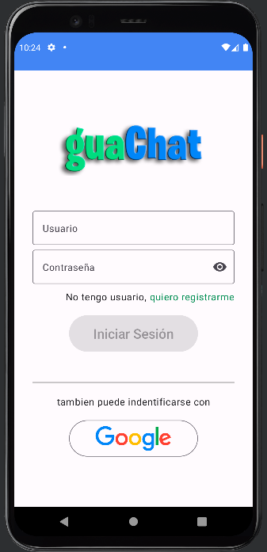
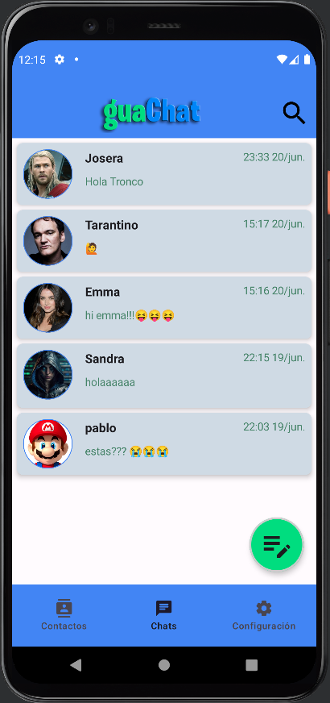
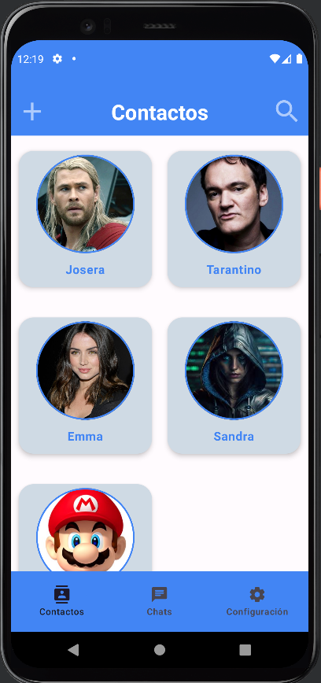

# Proyecto Guachat

  

Bienvenido al repositorio del Proyecto Guachat, una aplicación de mensajería móvil desarrollada como proyecto de fin de grado de DAM (Desarrollo de Aplicaciones Multiplataforma). Esta aplicación ha sido creada utilizando Kotlin Jetpack Compose y Firebase para gestionar la autenticación de usuarios, almacenamiento de datos y base de datos NoSQL.

## Capturas de pantalla

  
  

  
  

## Características principales

- Registro y autenticación de usuarios utilizando Firebase Authentication.
- Interfaz de usuario moderna y atractiva construida con Kotlin Jetpack Compose.
- Envío y recepción de mensajes de texto en tiempo real.
- Posibilidad de adjuntar imágenes y enviarlas a través de la aplicación.
- Almacenamiento de imágenes utilizando Firebase Storage.
- Base de datos NoSQL de alto rendimiento para almacenar y recuperar mensajes.

## Requisitos de instalación

Antes de ejecutar la aplicación en tu dispositivo, asegúrate de cumplir con los siguientes requisitos:

- Android Studio 4.0 o superior.
- Versión de Android 5.0 (API nivel 21) o superior.
- Conexión a internet para la comunicación en tiempo real y el acceso a Firebase.

## Cómo utilizar la aplicación

1. Clona este repositorio en tu máquina local.
2. Abre el proyecto en Android Studio.
3. Conecta tu dispositivo Android al ordenador o utiliza un emulador.
4. Haz clic en el botón "Run" en Android Studio para compilar y ejecutar la aplicación en tu dispositivo.
5. Una vez que la aplicación se ejecute en tu dispositivo, podrás registrarte o iniciar sesión utilizando tu cuenta de Firebase.
6. Explora las distintas funcionalidades de la aplicación y disfruta de la experiencia de mensajería móvil.

## Contribuir

Si quieres contribuir a este proyecto, puedes seguir los siguientes pasos:

1. Realiza un fork de este repositorio.
2. Crea una nueva rama con el nombre de tu funcionalidad: `git checkout -b nueva-funcionalidad`.
3. Realiza los cambios necesarios y commitea tus modificaciones: `git commit -m "Agregar nueva funcionalidad"`.
4. Sube tus cambios a tu repositorio remoto: `git push origin nueva-funcionalidad`.
5. Abre un pull request en este repositorio y describe tus cambios en detalle.

Agradecemos cualquier contribución que desees realizar para mejorar este proyecto.

## Licencia

Este proyecto se encuentra bajo la licencia [MIT License](LICENSE). Siéntete libre de utilizarlo y modificarlo según tus necesidades.